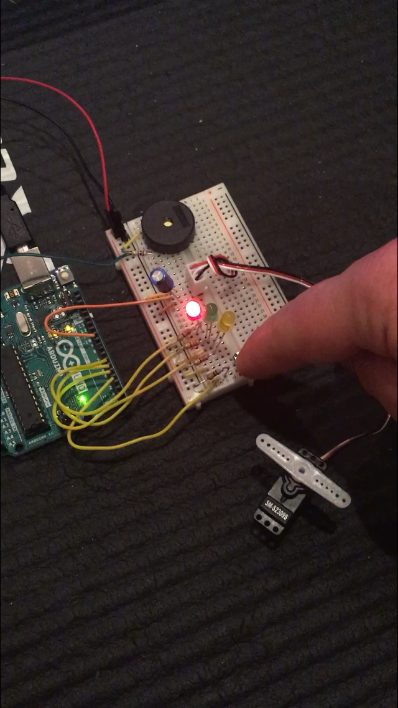

# arduino-knock-lock

Custom version of the typical knock lock example

## How it Works

Push the button to move the servo motor in the locked position. Knock three times for the servo motor to move to the unlocked position. Each valid knock will yield a yellow light. The locked and unlocked positions yield a red and green light, respectively.

### Locked Position

